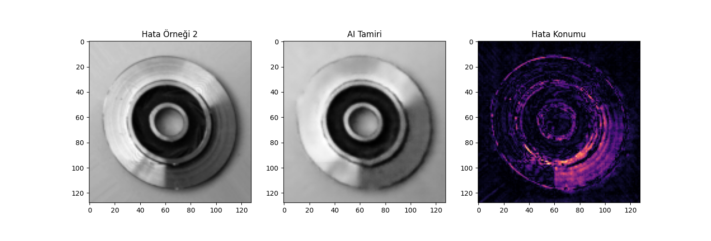
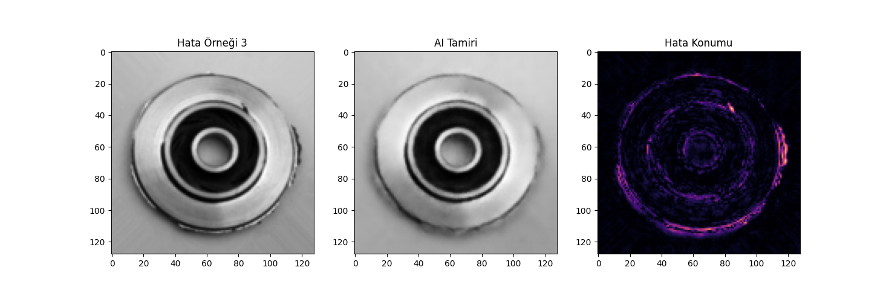
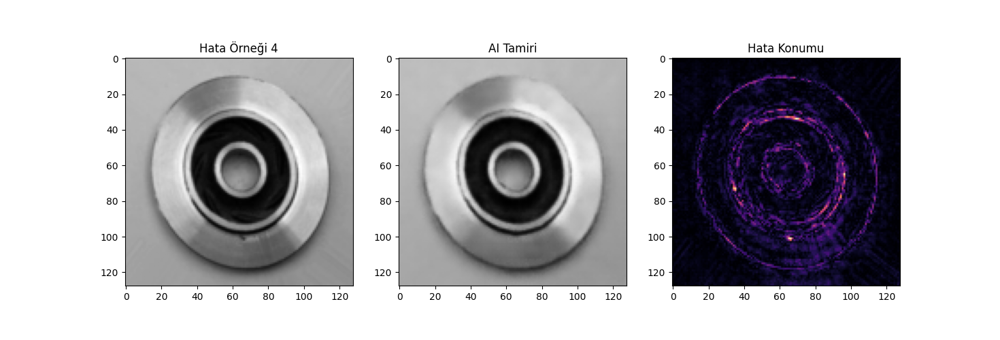
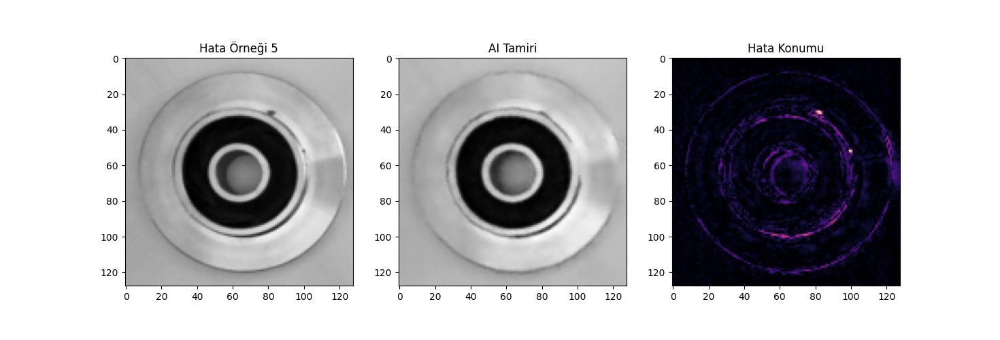
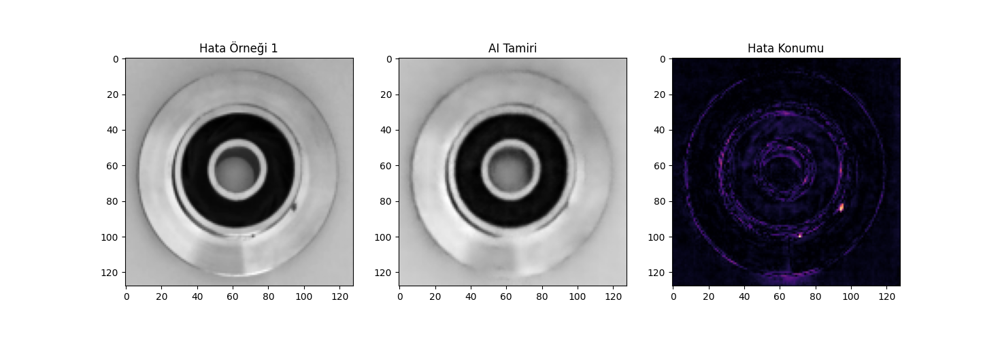
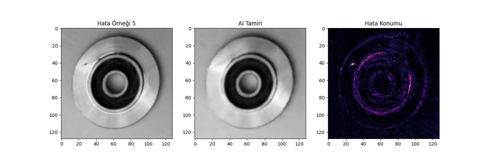

# 🚗 Automotive Casting Parts AI Quality Control

This project focuses on detecting manufacturing defects in automotive casting components using **Deep Learning** techniques.

## 🌟 Project Overview
Manual quality control in factories is time-consuming and prone to human error. This project utilizes a **Convolutional Autoencoder** model that learns exclusively from "OK" (non-defective) parts to autonomously distinguish and identify "Defective" ones.

## 🛠 Tech Stack & Hardware
* **Hardware:** Apple M3 Chip (MPS Acceleration)
* **Frameworks:** PyTorch, Torchvision, Matplotlib, PIL
* **Architecture:** Bottleneck Autoencoder with Inpainting Logic

## 🎯 Key Achievements
* **Unsupervised Learning:** Achieved anomaly detection without the need for labeled defective data.
* **Inpainting:** The AI successfully "reconstructed" defective areas by learning and mimicking surrounding metal textures.
* **Heatmaps:** Defect locations are visualized at the pixel level using reconstruction error heatmaps.

## 📊 Model Evaluation Results

| Sample 1 | Sample 2 | Sample 3 |
|:---:|:---:|:---:|
|  |  |  |
| **Sample 4** | **Sample 5** | **Sample 6** |
|  |  |  |

## 🚀 How to Run
1. Download the dataset from [Kaggle](https://www.kaggle.com/datasets/ravirajsinh45/real-life-industrial-production-dataset).
2. Place the dataset into the `casting_data` directory.
3. Run the training and evaluation script:
   ```bash
   python train.py
   
  --------------------------------------------------------------------------------
   
   # 🚗 Otomotiv Döküm Parçası Yapay Zeka Kalite Kontrolü

Bu proje, otomotiv sektöründe üretilen döküm parçalarındaki üretim hatalarını **Derin Öğrenme (Deep Learning)** kullanarak tespit etmek için geliştirilmiştir.

## 🌟 Proje Özeti
Fabrikalarda hatalı ürünlerin manuel olarak kontrol edilmesi yavaş ve maliyetlidir. Bu projede kullanılan **Convolutional Autoencoder** modeli, sadece "sağlam" parçaları inceleyerek "hatalı" olanları ayırt etmeyi öğrenir.

## 🛠 Kullanılan Teknolojiler & Donanım
* **Donanım:** Apple M3 Chip (MPS Acceleration)
* **Kütüphaneler:** PyTorch, Torchvision, Matplotlib, PIL
* **Mimari:** Bottleneck Autoencoder with Inpainting Logic

## 🎯 Başarılar (Key Results)
* **Unsupervised Learning:** Etiketli veriye ihtiyaç duymadan anomali tespiti.
* **Inpainting:** AI, döküm hatası olan bölgeyi etrafındaki metal dokusuna bakarak "yamayı" (reconstruct) başardı.
* **Isı Haritası:** Hatanın konumu pixel bazında ısı haritası (heat map) ile görselleştirildi.

## 🚀 Nasıl Çalıştırılır?
1. Veri setini [Kaggle'dan](https://www.kaggle.com/datasets/ravirajsinh45/real-life-industrial-production-dataset) indirin.
2. `casting_data` klasörüne yerleştirin.
3. `python train.py` komutunu çalıştırın.
